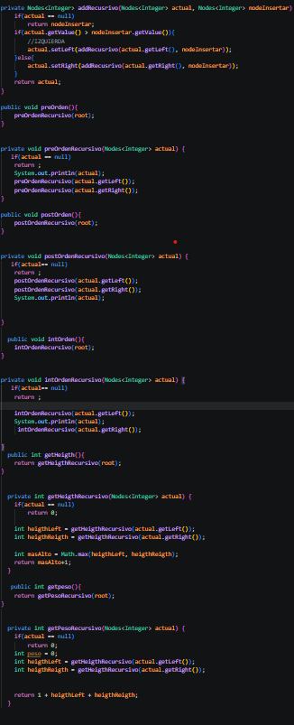
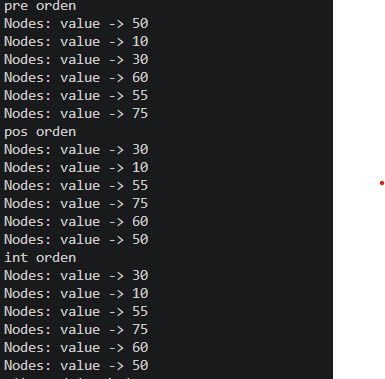
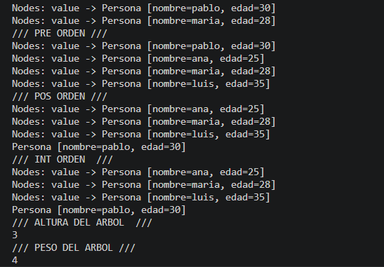
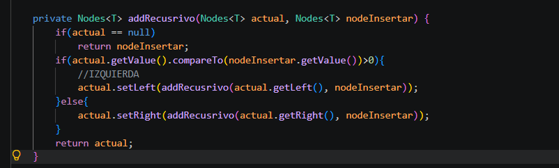
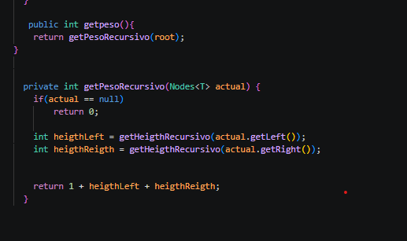
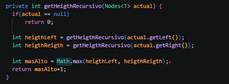
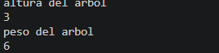
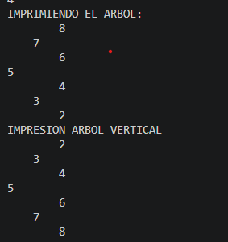

## Practica RECURSIVIDAD Y ARBOL .

- NOMBRE : kevin sacaquirin
- FECHA: 22 DE JUNIO DE 2026

## clase 1
- Implementacion de Recursividad y Arboles:

creamos carpetas models, node, tree , en node creamos una clase Node que le hacemos generica , creamos un nodo y lo instanciamos en el constructor , en la carpeta tree creamos una clase de IntTree en donde aplicamos la recursividad y el orden de los arboles que son el preorden , intorden, posorden. en las siguienetes clases:

Impresion:

Impresion de arbol por edades:

## clase 2.

- Implememtacion de Recursividad y Arboles:

Generamos un metodo para calcular el peso , lo que nos describe el metodo es que nos guiamos en la cantidad total de nodos que tiene, primero verifica si no es nulo como el anterior , luego calcula recursivamente el pero de lado izuierdo y derecho , sumando mabos resultados junto a 1 que representa la matriz o en nodo actual.

- Implementacion de recursivida y arboles :

Generamos una clase persona con el metodo add que inserta un nodo en un arbol de comparando el valor de los nodos que en este caso seria las edades de las personas , compara el las hojas del arbol de la izquierda o derecha dependiendo si su valor es mayor o menor si es mayor a la derecha y si es menor a la izquierda

metodo :

metodo implementado:

En la clase IntTree , realizamos un metodo que calcule la altura de un arbol binario de forma recursiva , es decir ,determina cuantos niveles tiene el arbol desde un nodo hasta la hoja mas profunda , esto primero verifica si elnodo actual no es nulo sino retorna con 0 porque no hay nada en el arbol , luego hace reursividad llamando asi misma  para calcular la altura de lado izquierdo y derecho y compara ambos valores para quedarse con el mayor y a este le suma 1.

metodo implementado:

Impresion:

## Clase 3.

En la clase Ejercicio1 recibe un arreglo de numeros y construye un arbol binario insertando cada elemento mediante el metodo de add . luego obtiene la raiz , los metodos de printTree y printInvertido, el primero se encarga de mostrar el arbol de hojas derecho arriba despues arriba y al izquierda , mientras que el printInvertido tiene el recorrido de izquierda a derecha generando estas impresiones:

Metodo de printTree:
 public void printTree(Nodes<Integer> root){
        System.out.println("IMPRIMIENDO EL ARBOL: ");
        printTreeRecursivo(root,0);
    }
    private void printTreeRecursivo(Nodes<Integer> root, int nivel) {
         if(root == null)
        return ;
        printTreeRecursivo(root.getRight(),nivel+1);
        for(int i = 0; i< nivel;i++){
            System.out.print("    ");
        }
         System.out.println(root.getValue());
        printTreeRecursivo(root.getLeft(),nivel+1);
       
    }

Metodo de printInvertido:

 public void printInvertido(Nodes<Integer> root){
        System.out.println("IMPRESION ARBOL VERTICAL");
        printInvertirRecursivo(root,0);
    }
    private void printInvertirRecursivo(Nodes<Integer> root, int nivel){
         if (root == null) {
        return;  
    }
       printInvertirRecursivo(root.getLeft(), nivel+1);
        for (int i = 0; i < nivel; i++) {
        System.out.print("    ");
        }

        System.out.println(root.getValue());

        printInvertirRecursivo(root.getRight(), nivel+1);
    }

