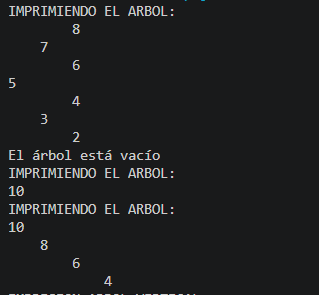
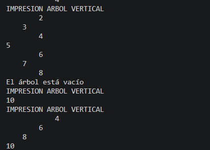
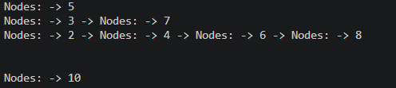
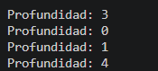

## EJERCICIOS DE LOGICA CON ESTRUCTURA DE DATOS.

- Nombre del estudiante: Kevin Sacaquirin

- Descripcion general del proyecto:

En el proyecto se realizo diferentes ejerciciosde logica como son ordenar un arbol de derecha izquierda , los ordenenos tanto horizontales como verticales , ademas de realizar metodos de recursividad para diferentes metodos como el de profundidad , ademas si utilizo colas para desarrolar el metodo de mostrar los niveles y jugar con los print para impresiones vistosas.

- EXPLICACION DEL EJERCICIO 1:

En el ejercicio 1 se realizo un arbol binario de busqueda con el metodo de insert que recibe un arreglo de numeros , crea un arbol vacio va insertando cada numero con el metodo implemntado de add , luego de esto obtiene la raiz y verifica si esta vacio si esto se cumple llama al metodo de print tree para mostrar en este es donde se usa la logica y la resolucion del ejercicio1 este metodo sirve para mandarle al arbol mientras printTreeRecursivo hace el reccoirdo de forma recursiva , primero a la hoja derecha y luego a la hoja izquierda aqui se desarrola la impresion con los print para nos salga de esta manera:

con el siguiente codigo :

 public void printTree(Nodes<Integer> root){
        System.out.println("IMPRIMIENDO EL ARBOL: ");
        printTreeRecursivo(root,0);
    }
    private void printTreeRecursivo(Nodes<Integer> root, int nivel) {
         if(root == null)
        return ;
        printTreeRecursivo(root.getRight(),nivel+1);
        for(int i = 0; i< nivel;i++){
            System.out.print("    ");
        }
         System.out.println(root.getValue());
        printTreeRecursivo(root.getLeft(),nivel+1);
       
    }

- RESOLUCION DEL EJERCICIO2:

Este problema de igual manera que el anterios juega con logica , este ejercicio recibe la raiz del arbol y llama al metodo recursivo para imprimirlo , el metodo printInvertido primero verifica si el nodo no es nulo para detener la recursion como su caso base , luego recorre el primer hijo de la izquierda y lo imprime con los espacios , asi muestra el valor actual del nodo y finalmente recorre el hijo derecha va de izquierda a derecha a diferencia del primero . Resultado en los casos difernetes :

con el siguiente codigo:

    public void printInvertido(Nodes<Integer> root){
        System.out.println("IMPRESION ARBOL VERTICAL");
        printInvertirRecursivo(root,0);
    }
    private void printInvertirRecursivo(Nodes<Integer> root, int nivel){
         if (root == null) {
        return;  
    }
       printInvertirRecursivo(root.getLeft(), nivel+1);
        for (int i = 0; i < nivel; i++) {
        System.out.print("    ");
        }

        System.out.println(root.getValue());

        printInvertirRecursivo(root.getRight(), nivel+1);
    }

- RESOLUCION DEL EJERCICIO3:

El ejercicio3 nos indica que recorre el arbol binario por niveles y guarda los nodos cada vez que los recorre y los guarda en una lista , donde se almacena los niveles y tambien verifica si la raiz no es nula sino hace un return de la lista , despues de esta verificacion utiliza una cola para ir procesando los nodos desde la raiz hasta las hojas , en cada vez que entra al while este sabe los niveles para saber cuantos nodos estan en el nodo actual , lo extrae con el poll y ademas los elimina y asi hasta terminar nos devuelve un resultado , que nos da una lista con los niveles con la impresion con juegos de print. Resultado:

con el siguiente codigo:

 public List<List<Nodes<Integer>>> listLevels(Nodes<Integer> root) {

        List<List<Nodes<Integer>>> resultado = new ArrayList<>();

        if (root == null) {
            return resultado;
        }

        Queue<Nodes<Integer>> cola = new LinkedList<>();
        cola.add(root);

        while (!cola.isEmpty()) {

            int tamaño = cola.size();
            List<Nodes<Integer>> nivel = new ArrayList<>();

            for (int i = 0; i < tamaño; i++) {

                Nodes<Integer> actual = cola.poll();
                nivel.add(actual);

                if (actual.getLeft() != null) {
                    cola.add(actual.getLeft());
                }

                if (actual.getRight() != null) {
                    cola.add(actual.getRight());
                }
            }

            resultado.add(nivel);
        }

        return resultado;
    }

- EJERCICIO4:

En este ejercicio es similar al realizado en clase que fue calcular pero , pero ahora es lo niveles aunque la logica es la misma , este nos indica la profundidad del arbol , primero verifica la raiz si no es nula despues se llama asi mismo de forma recursiva para calular su profundidad tanto al lado izquierdo como el derecho y finalmente compara ambas profundidades usando el Math y este nos devuelve el mayor y a ese le sumamos 1 porque ese 1 es el nodo actual .
RESULTADO:

con el siguiente codigo:

 public int maxDepth(Nodes<Integer>  root) {
    if (root == null) {
        return 0;
    }

    int leftDepth = maxDepth(root.getLeft());
    int rightDepth = maxDepth(root.getRight());

    return 1 + Math.max(leftDepth, rightDepth);
}

## URL DEL REPOSITORIO:

https://github.com/kevin31-08/icc-est-u2-estructurasnolineales